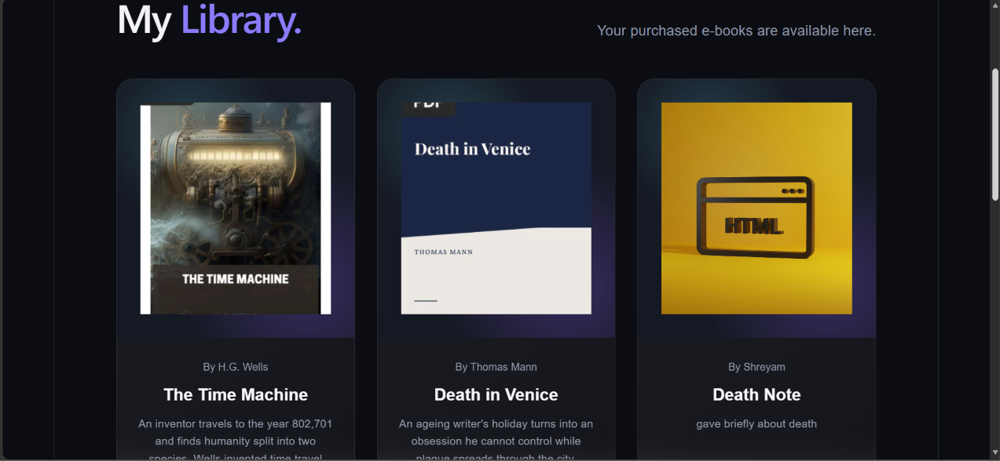
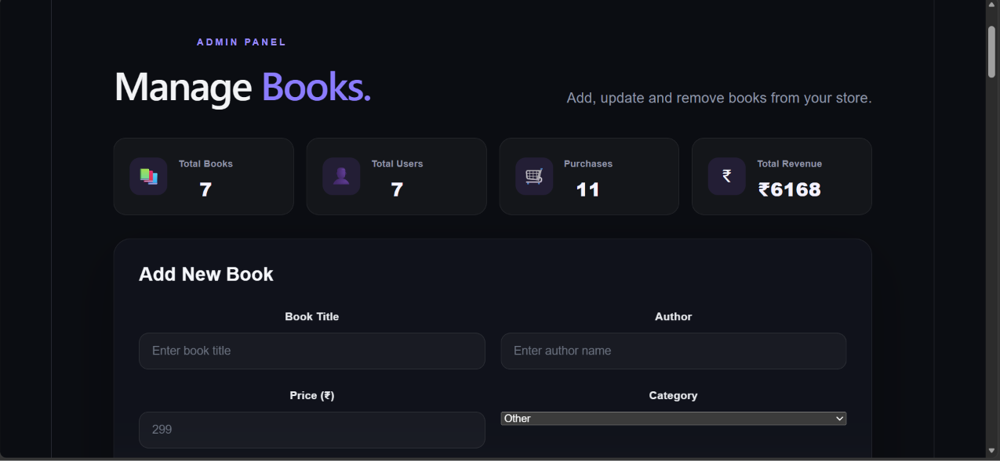

# 📚 E-Book Store

A full-stack e-book selling platform where users can browse books, purchase e-books, access their personal library, download purchased PDFs, and submit reviews.

## 🚀 Features

- User signup and login
- JWT-based authentication
- Role-based admin access
- Browse e-books
- Search and category filtering
- Book details and reviews
- Razorpay test payment integration
- Purchase management
- Personal "My Library"
- Protected PDF downloads
- Ratings and reviews
- Admin dashboard
- Add, edit and delete books
- PDF and cover image uploads
- Responsive UI
- Secure API routes

## 📸 Screenshots

### 🏠 Home Page


### 📖 Book Details


### 🔐 Login


### 💳 Payment


### 📚 My Library



### 👨‍💼 Admin Dashboard



## 🛠️ Tech Stack

### Frontend

- React
- Vite
- JavaScript
- CSS

### Backend

- Node.js
- Express.js
- MongoDB
- Mongoose
- JWT
- Multer

### Payment

- Razorpay Test Mode

### Security

- Helmet
- Express Rate Limit
- JWT authentication
- Protected PDF access
- Role-based authorization

## 📁 Project Structure

```text
ebook-store/
│
├── client/
│   ├── src/
│   ├── public/
│   └── package.json
│
├── server/
│   ├── controllers/
│   ├── middleware/
│   ├── models/
│   ├── routes/
│   ├── uploads/
│   └── server.js
│
├── screenshots/
│   ├── home.png
│   ├── book-details.png
│   ├── login.png
│   ├── payment.png
│   ├── library.png
│   └── admin-dashboard.png
│
├── .gitignore
└── README.md